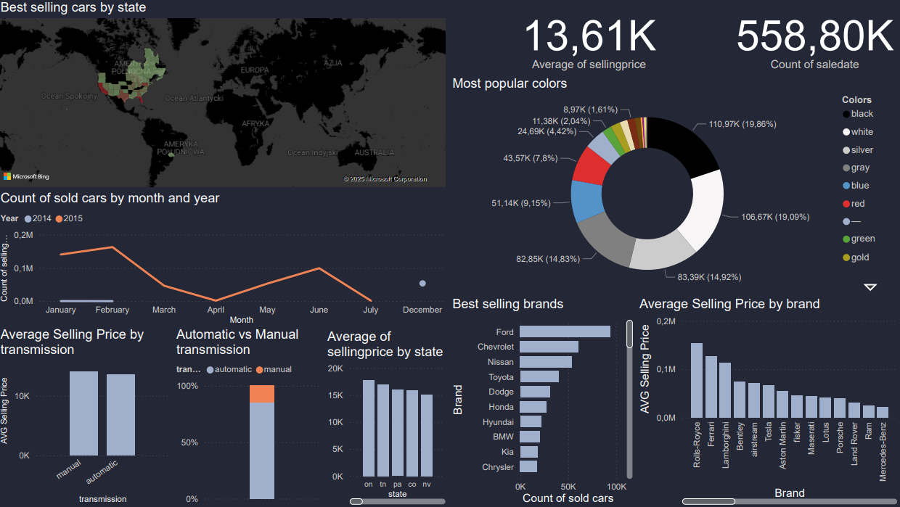

# Vehicle Sales ETL & Visualization  

This project automates the process of extracting, transforming, and loading vehicle sales data, followed by advanced SQL analytics and Power BI visualizations.  

## Project Overview  

The goal of this ETL project is to build a clean, structured, and analysis-ready dataset.  
The pipeline performs:  
1. **Data Extraction** -mfrom raw CSV files  
2. **Data Transformation** - cleaning, standardizing, and normalizing the dataset  
3. **Data Loading** - into an SQLite database and CSV output  
4. **Analysis & Visualization** - using SQL and Power BI  

---

## Files Included  

- `extract.py` - Loads raw CSV data into a pandas DataFrame  
- `transform.py` - Cleans text fields, normalizes brands, fixes dates, removes invalid rows  
- `load.py` - Exports the transformed dataset  
- `pipeline.py` - Full ETL workflow orchestrator  
- `vehicles_sales_analysis.sql` - Analytical SQL queries (top brands, price difference, sales by month)  
- `Vehicle_visualisation.pdf` - Power BI dashboard with interactive charts  

---

## Tech Stack  

- **Python** - Data extraction and ETL automation  
- **Pandas / NumPy** - Data cleaning and processing  
- **TheFuzz** - String similarity for brand name correction  
- **SQLAlchemy / SQLite** - Data storage  
- **SQL** - Analytical queries  
- **Power BI** - Data visualization and interactive dashboards    

---

## Dashboard Preview 

---

## Author  
**Michał Figwer**
